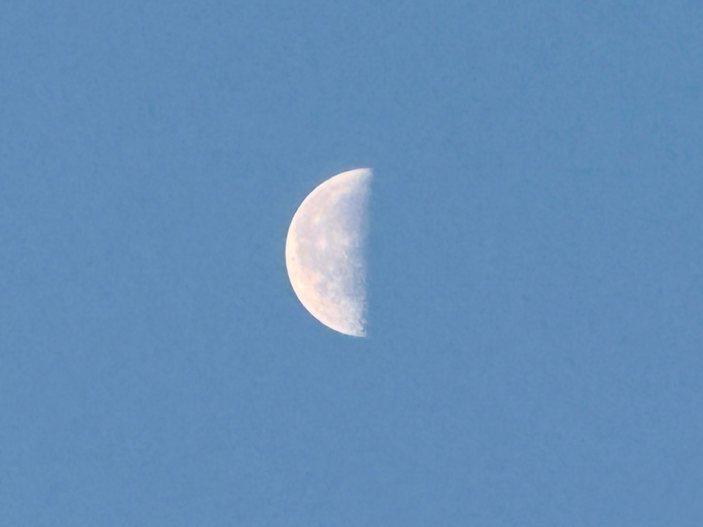
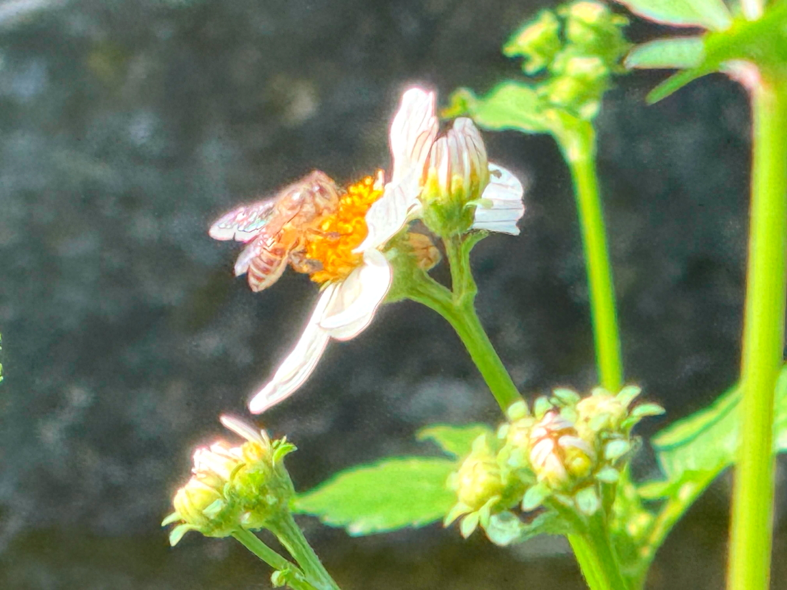
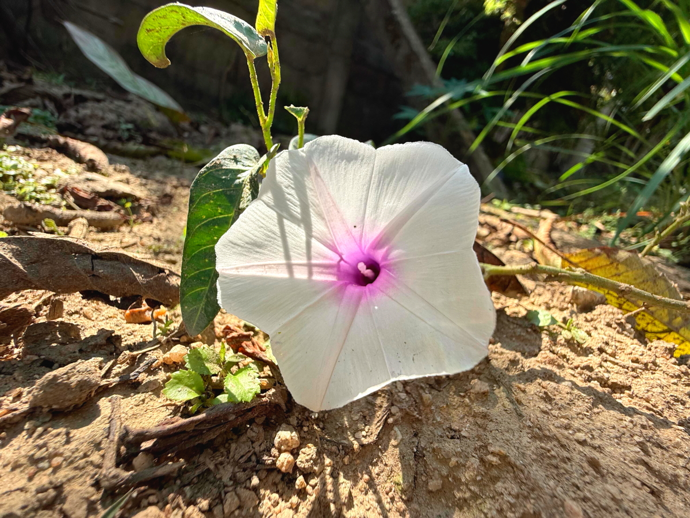
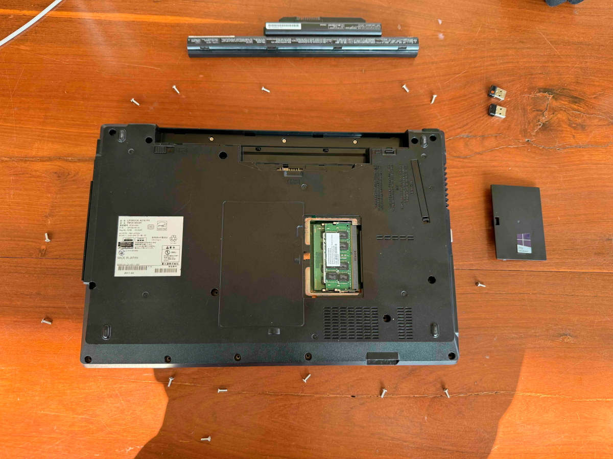
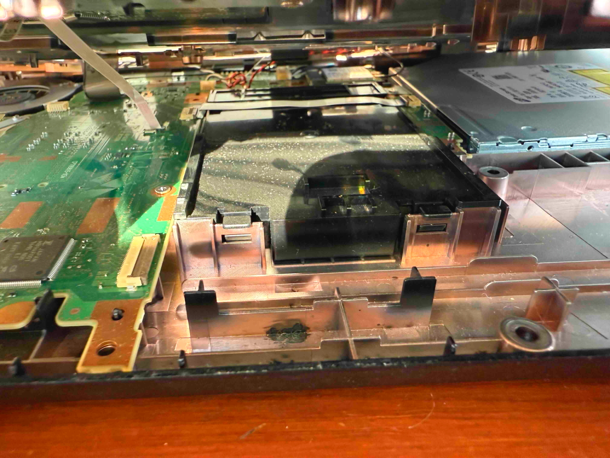
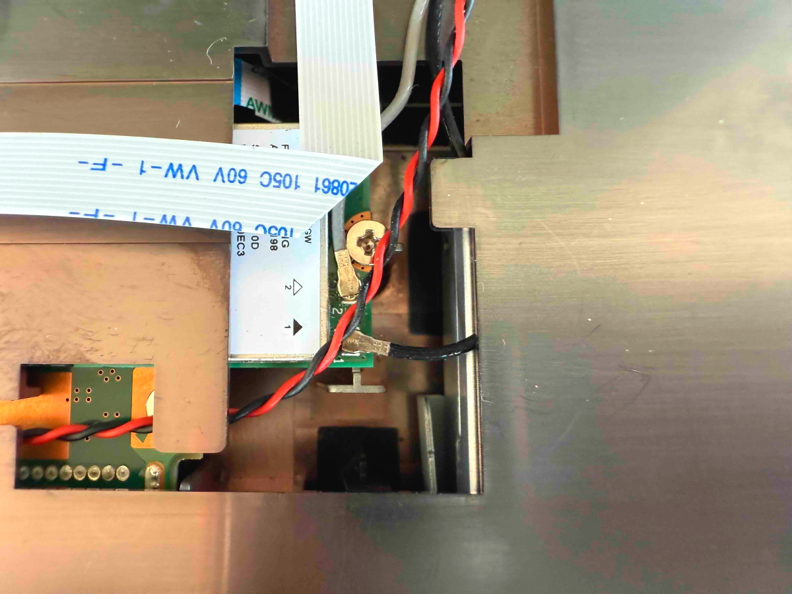
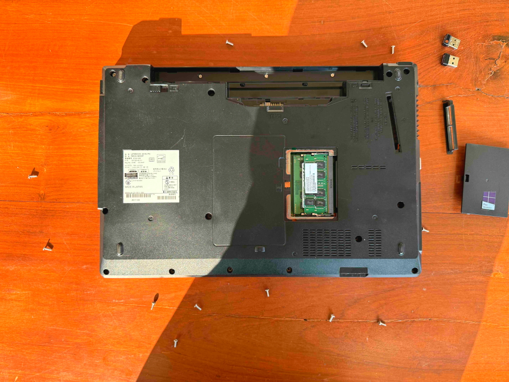
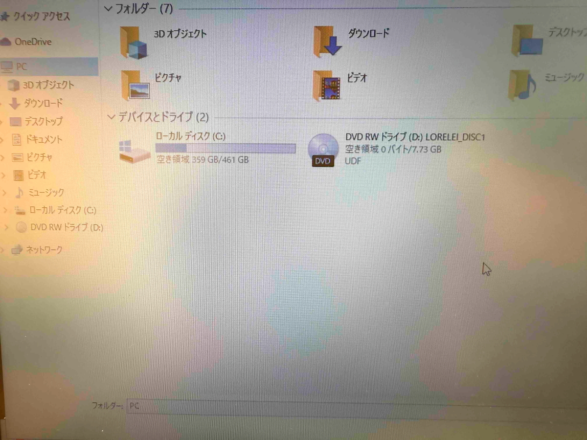
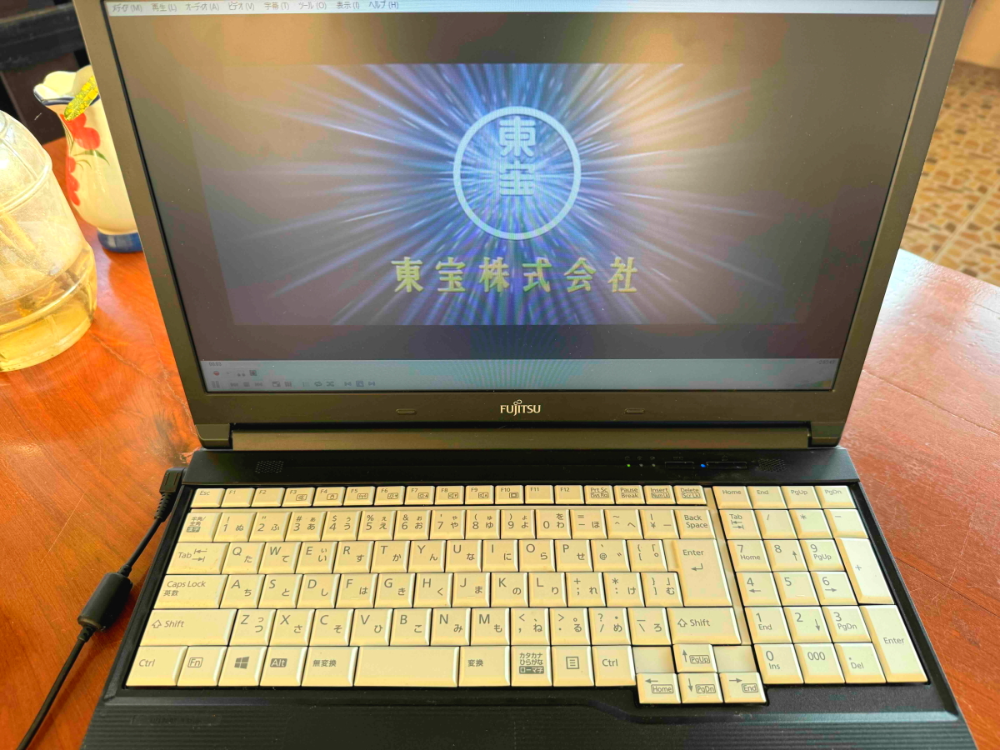
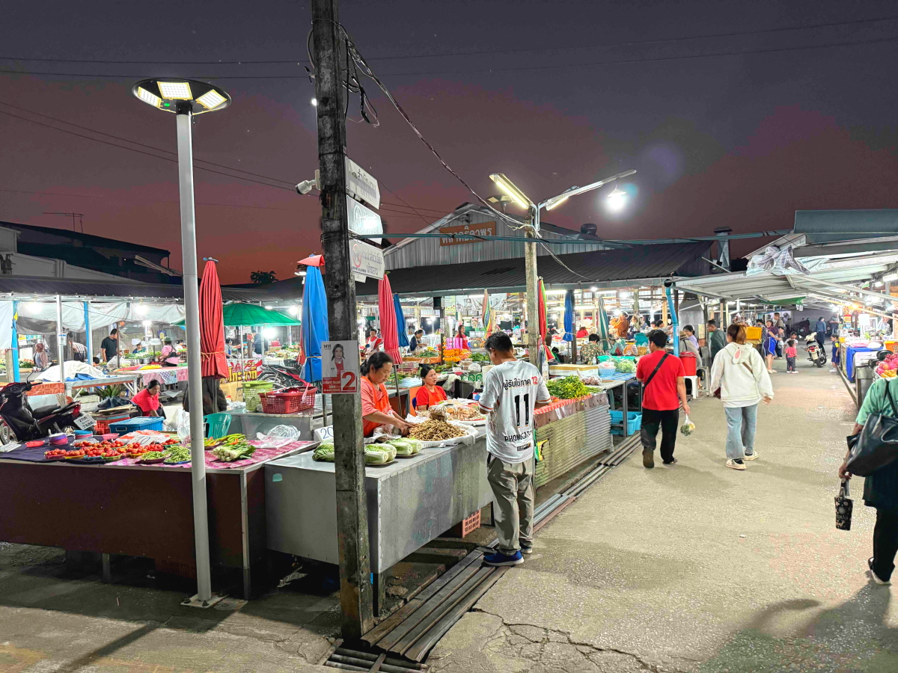

# 20250122_chiangrai

<html>
<head>

<meta charset="UTF-8">
<meta http-equiv="Content-Type" content="text/html; charset=UTF-8">
<meta http-equiv="X-UA-Compatible" content="IE=EmulateIE10" />
<meta http-equiv="X-UA-Compatible" content="IE=edge">

<!--ここから上はお決まりの定型文です-->

<!--ここからが表現の書式などを決めるcssという部分-->

<link href="https://cdnjs.cloudflare.com/ajax/libs/lightbox2/2.7.1/css/lightbox.css" rel="stylesheet">

</head>

<body>

モバイル端末をお使いの場合は、画面を横向きにすると
より見やすくご覧頂けます。

<!--ここ上は、ほぼそのまま使います！-->

<!--QRコードの挿入例-->

 アクセス用QRコード

<marquee direction="left" scrollamount="20" width="30%">(^_^)/~alis</marquee>

<!--流れ文字の挿入例-->
<h1><marquee behavior="left">!!! 2025/01/22、平穏な1日、遺品のPC修理などして、最後は市場でお買い物!!!</marquee></h1>

                          

<!--ここから下が、本体部分-->

<h2>6日続けて西の空にお月様が沈んで行く映像は綺麗な半月に 22日 朝7:10</h2>

<h2>綺麗な半月、太陽とのなす角が90度と言うことになります</h2>

<h2>同じ時刻の日の出です 朝7:10</h2>

<h2>雑草ですが、陽射しを浴びてお花たちも輝きます</h2>

<h2>故人の命日に生まれたアヒルの子が親とはぐれて足元でよちよち このあと親鳥のところに戻しました</h2>
<iframe width="560" height="315" src="https://www.youtube.com/embed/JZl6Pp-P7Wg?si=gar0WMgLnnQlu47V" title="YouTube video player" frameborder="0" allow="accelerometer; autoplay; clipboard-write; encrypted-media; gyroscope; picture-in-picture; web-share" referrerpolicy="strict-origin-when-cross-origin" allowfullscreen></iframe> 

<h2>お隣の家からは、野鳥がこちらに何かさえずりかけています</h2>
<iframe width="560" height="315" src="https://www.youtube.com/embed/tu_dpZIjJ5s?si=zAg_z77X9FovKwp3" title="YouTube video player" frameborder="0" allow="accelerometer; autoplay; clipboard-write; encrypted-media; gyroscope; picture-in-picture; web-share" referrerpolicy="strict-origin-when-cross-origin" allowfullscreen></iframe> 

<h2>遺品としていただいたNoto PC、DVDドライブが不調で分解修理</h2>

<h2>ドライブを固定しているステーがずれていたのでネジを緩めて修正</h2>

<h2>細かい配線の接触不良も修正</h2>

<h2>外したネジは一本も余らずに締め直しできて一安心</h2>

<h2>画面上でDVDドライブが認識されて、修理は成功</h2>

<h2>DVDで映画が観られるようになりました</h2>

<h2>作業中のBGMはコレ、イライラ解消には最高です</h2>
<iframe width="560" height="315" src="https://www.youtube.com/embed/r395_jOC1_Q?si=YoHiP_JNuEcSAvgR" title="YouTube video player" frameborder="0" allow="accelerometer; autoplay; clipboard-write; encrypted-media; gyroscope; picture-in-picture; web-share" referrerpolicy="strict-origin-when-cross-origin" allowfullscreen></iframe> 

<h2>いつものスーパーに向かいます、夕陽に向かって走れ！</h2>

<h2>メーチャンの市街も綺麗に暮れて行きました</h2>

<!--
<h2>同じ場所のGoogleMapsストリートビュー</h2>
<iframe src="https://www.google.com/maps/embed?pb=!4v1737592608291!6m8!1m7!1sFCkoLV6DJ48bqq3CzBCd_w!2m2!1d20.1468671110346!2d99.85627538854762!3f281.131226989732!4f4.525319710522808!5f1.349155548152566" width="600" height="450" style="border:0;" allowfullscreen="" loading="lazy" referrerpolicy="no-referrer-when-downgrade"></iframe> 
-->

<h2>最初の夕陽から1時間後には、いつもの綺麗なグラデーション</h2>

<h2>幻想的な夕焼けから、最後は現実に戻って市場でお買い物 画像クリックでGoogleMapsのストリートビューに飛びます ↓</h2>

   
<h2>以上、6日連続で朝一の東の空に沈みゆく月からスタート。 平穏な1日に遺品のPC修理が無事終了、最後は市場でお買い物でした。 ここまで観ていただきありがとうございました。</h2>

     
<h2>
<a href="https://torokoid.github.io/20241126_chiangrai/" target="_blank">Back to the menu page</a>
</h2>

   

         

  

      

<!--本体はここまで-->

<!--画面に空白地帯を作って、背景が見えるようにしています-->
                                              

<!-- フッタ -->
<footer>

Copyright 2025/01/23 alis @ChiangRai

</footer>

<!--HPにさまざまなJavaScriptを呼び込むための書式-->

